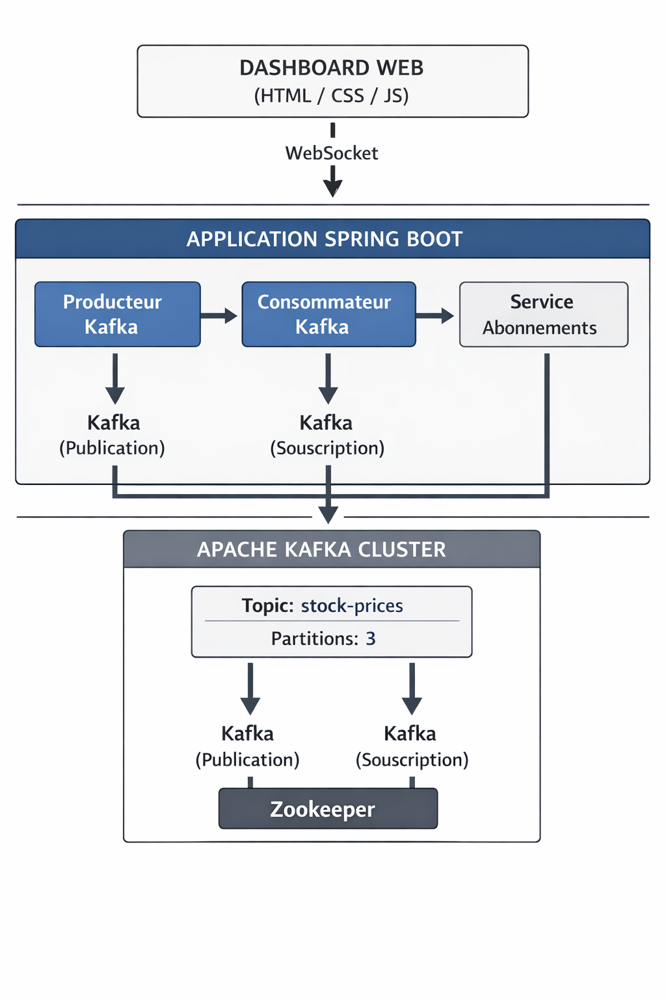
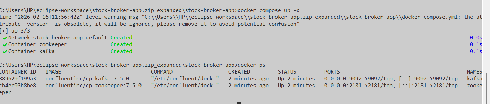
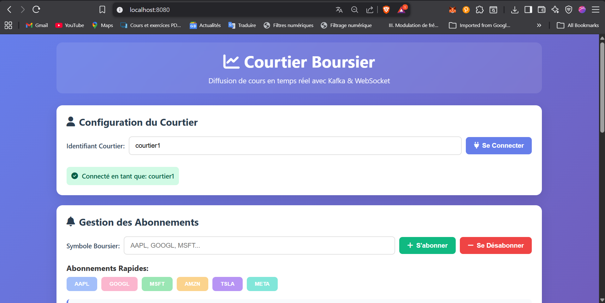
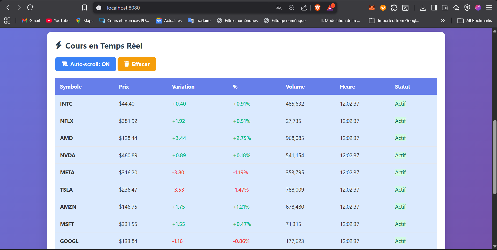
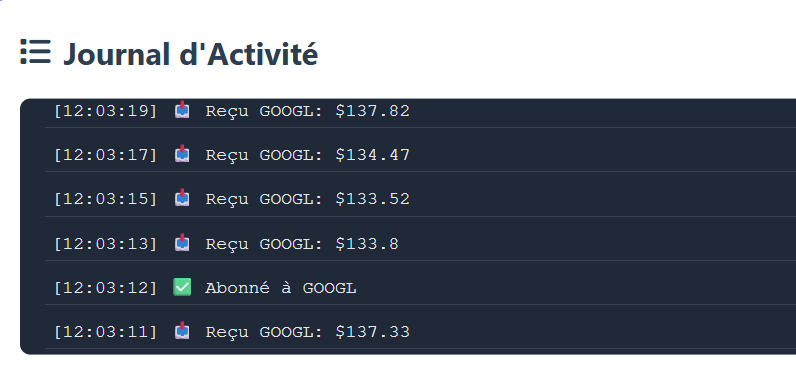

```markdown
# Application de Diffusion des Cours Boursiers en Temps Réel avec Kafka et Spring Boot

## Description du Projet

Ce projet implémente une application distribuée de diffusion en temps réel des cours boursiers en utilisant **Apache Kafka** comme système de messagerie et **Spring Boot** pour le développement backend.

L'objectif principal est de permettre à plusieurs **courtiers** (clients simulés) de s'abonner à des titres boursiers spécifiques et de recevoir automatiquement les mises à jour de prix publiées par un producteur de données simulées.

L'architecture suit le modèle **publication/abonnement (pub/sub)** de Kafka, offrant une solution scalable et résiliente pour le traitement de flux de données financières.

> **Note** : Cette implémentation est une version simplifiée et fonctionnelle réalisée en moins de 12 heures, démontrant les concepts clés du projet. Elle peut être étendue (WebSocket, interface web, microservices séparés, etc.) comme décrit dans le rapport complet.


*Figure 1 : Architecture globale de l'application*

## Fonctionnalités Principales

- Génération automatique et périodique de cours boursiers simulés (AAPL, TSLA, MSFT, GOOGL, META, NVDA, etc.)
- Publication des mises à jour sur un topic Kafka (`stock-prices`)
- Simulation de plusieurs courtiers avec abonnements prédéfinis
- Filtrage en temps réel des messages reçus
- Affichage des publications et réceptions dans la console
- Configuration simple via Docker
- Endpoint REST optionnel pour gérer les abonnements dynamiquement

## Technologies Utilisées

- **Java 21**
- **Spring Boot 3.2.x** (avec Spring for Apache Kafka)
- **Apache Kafka 3.6.x** (via images Confluent)
- **Docker & Docker Compose**
- **Maven**
- **Lombok** (optionnel)

## Structure du Projet


s📦 stock-kafka-demo/
├── 📁 src/
│   └── 📁 main/
│       ├── 📁 java/com/exemple/stockkafka/
│       │   ├── 📁 dto/
│       │   │   └── 📄 PriceUpdate.java (record)
│       │   ├── 📁 producer/
│       │   │   └── 📄 StockPriceSimulator.java
│       │   ├── 📁 consumer/
│       │   │   └── 📄 BrokerPriceListener.java
│       │   ├── 📁 controller/
│       │   │   └── 📄 SubscriptionController.java (optionnel)
│       │   └── 📄 StockKafkaDemoApplication.java
│       └── 📁 resources/
│           └── 📄 application.properties
├── 📄 docker-compose.yml
├── 📄 pom.xml
└── 📄 README.md


## Installation et Lancement

### 1. Lancer Kafka avec Docker

```bash
docker compose up -d
```

Vérification :
```bash
docker ps
```

*Figure 3 : Lancement de Kafka et Zookeeper via Docker Compose*

### 2. Lancer l’application Spring Boot

Dans Eclipse : Clic droit sur `StockKafkaDemoApplication.java` → **Run As → Spring Boot App**

### 3. Démonstration en temps réel

Une fois l’application lancée, vous verrez dans la console :


*Symboles et connexion*

*Exemple de publication et réception des cours par les courtiers*

*Journal d'activité (abonnement)*

**Abonnements par défaut :**
- **Courtier-Paris** → AAPL, TSLA, LVMH
- **Courtier-London** → TSLA, BP, GS
- **Courtier-NewYork** → AAPL, MSFT, NVDA, GOOGL


## Extensions Possibles

- Ajout de WebSocket + interface web (HTML/JS)
- Séparation en microservices (Producteur / Consommateur)
- Persistance des abonnements (PostgreSQL / Redis)
- Monitoring avec Kafka UI ou Prometheus
- Tests unitaires et de performance

## Auteur

**SAWADOGO S. Abdel K Nourou**  
Cycle Ingénieur Génie Informatique  
Faculté des Sciences et Techniques de Settat  
Année Universitaire 2024-2025  

**Encadré par :** Mr Marzouk  

**Date :** Février 2026

## Références

- Rapport complet : `Rapport_Projet_Courtier.pdf`
- Apache Kafka : https://kafka.apache.org/
- Spring Kafka : https://spring.io/projects/spring-kafka

---

**Merci d'avoir utilisé ce projet !**

```
